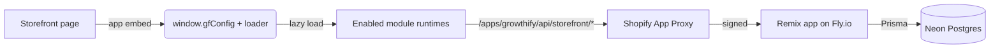

# Architecture

Growthify is a Yarn workspaces monorepo with three deployable apps and two shared packages.

## The pieces

```
all-in-one-shopify/
├── apps/
│   ├── shopify-app/      Remix app — OAuth, billing, webhooks, admin UI, storefront APIs
│   ├── theme-extension/  72 Liquid app blocks + the Growthify Embed app-embed
│   └── web/              Marketing site (React 19 + Vite + Firebase)
└── packages/
    ├── shared-types/     TypeScript types shared across apps
    └── shared-utils/     Pure helpers (formatting, validation, money math)
```

## Request flow on a real storefront

1. A shopper loads a storefront page. The **Growthify Embed** app-embed renders a small inline script that defines `window.gfConfig` (the app-proxy base URL `/apps/growthify`, the shop domain, and the asset base) and loads `growthify-embed.js`.
2. `growthify-embed.js` lazy-loads only the module runtimes for the modules the merchant enabled.
3. Each module's block (for example the reviews carousel or cart drawer) reads `window.gfConfig.appUrl` and calls the server through the **Shopify App Proxy** at `/apps/growthify/api/storefront/*`.
4. Shopify forwards the proxied request to the Remix app on Fly.io. The route validates the proxy signature, resolves the shop, checks the relevant [entitlement](../admin/entitlements.md), reads/writes Postgres through Prisma, and returns JSON.



## Backend stack (firm)

- **Backend = Node + Remix only** (`apps/shopify-app`). No PHP/Laravel/Rails.
- **Production DB = Neon Postgres** (serverless Postgres, branch-per-environment). Dev DB = SQLite via Prisma.
- **Licensing = Shopify App Subscriptions only** — no custom license keys. Every premium feature is gated through `verifySubscription(shopDomain)` + an `Entitlement(shopId, moduleId)` row.

## Admin UI

The embedded admin is built with Shopify **Polaris** inside Remix routes. There are **52 admin feature pages** (`admin.features.*`) plus module-config routes; a module's tile in the Modules dashboard redirects to its real config route. See [Admin features](../admin/features.md).

## Why one embed + one loader

Enabling 16 modules' worth of `<script>` tags on every storefront would wreck Core Web Vitals. Instead, one embed boots one loader, and the loader fetches only the runtimes for enabled modules. The theme blocks themselves are server-rendered Liquid, so above-the-fold content needs no JavaScript at all.
