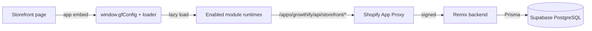

<head>
  <script type="application/ld+json">
    {JSON.stringify({
      '@context': 'https://schema.org',
      '@type': 'FAQPage',
      mainEntity: [
        {
          '@type': 'Question',
          name: 'Why does Growthify use one app embed instead of separate scripts per feature?',
          acceptedAnswer: {
            '@type': 'Answer',
            text: 'Because sixteen modules worth of script tags on every page would damage Core Web Vitals for stores using two of them. One embed boots one loader, and the loader fetches only the runtimes for enabled modules. The two always-loaded scripts total roughly 5 KB.',
          },
        },
        {
          '@type': 'Question',
          name: 'Is Firebase part of the Growthify backend?',
          acceptedAnswer: {
            '@type': 'Answer',
            text: 'No. Firebase provides static hosting for the web app and nothing else. Authentication is Supabase Auth, the database is Supabase PostgreSQL, and server logic runs in the Remix app. Firestore is locked down and unused.',
          },
        },
        {
          '@type': 'Question',
          name: 'Does Growthify use a separate development database?',
          acceptedAnswer: {
            '@type': 'Answer',
            text: 'No. One hosted Supabase PostgreSQL project serves both development and production. That is why migrations are forward-only and additive, and why any workflow that can drop and recreate the schema is refused.',
          },
        },
        {
          '@type': 'Question',
          name: 'Why do storefront blocks call an app proxy instead of the backend directly?',
          acceptedAnswer: {
            '@type': 'Answer',
            text: 'The proxy gives storefront requests a same-origin path and a Shopify-signed envelope the server can verify. Calling the backend host directly would need CORS, would expose the host, and would carry no proof that the request came from that shop.',
          },
        },
        {
          '@type': 'Question',
          name: 'Is there a CI/CD pipeline that deploys Growthify?',
          acceptedAnswer: {
            '@type': 'Answer',
            text: 'No. Continuous integration runs tests only. Every deployment is a deliberate manual command, which is a recorded project decision rather than an oversight.',
          },
        },
        {
          '@type': 'Question',
          name: 'How many routes does the backend have?',
          acceptedAnswer: {
            '@type': 'Answer',
            text: 'As audited on 2026-09-12 the Remix app had 274 route files: 55 storefront API routes, 51 admin feature screens, the admin API, the embedded admin pages, six webhook receivers and the health endpoints.',
          },
        },
      ],
    })}
  </script>
</head>

# Architecture

**Growthify is a Yarn-workspaces monorepo whose deployable surfaces each own one job: a Remix backend that holds all server logic, a theme app extension that renders on the storefront, checkout-level extensions, a React web app for marketing and account management, and this documentation site.** Shared packages carry the types and the plan registry that several surfaces must agree on.

This page explains what talks to what, and why the boundaries fall where they do.

## Who this page is for

- **Developers** joining the codebase or integrating against it, who need the mental model before reading routes.
- **Technical merchants and agencies** evaluating what actually runs on their storefront and where their data lives.
- **Reviewers** checking data-flow claims against how the system is genuinely wired.

## The surfaces

```
all-in-one-shopify/
├── apps/
│   ├── shopify-app/      Remix — OAuth, billing, webhooks, admin UI, storefront + merchant APIs
│   │   └── extensions/   Shopify Functions (BOGO, quantity breaks) + checkout UI extensions
│   ├── theme-extension/  72 Liquid app blocks + the Growthify Embed app-embed
│   └── web/              Marketing site + merchant account area (React 19 + Vite)
└── packages/
    ├── shared-types/     TypeScript types shared across apps
    └── shared-utils/     The canonical plan registry, defaults, formatters
```

The **Remix app is the only place server logic lives**. The theme extension holds no secrets and makes no privileged calls; it renders Liquid and calls the proxy. The web app is a separate product surface with its own authentication, not a second backend.

As audited on 2026-09-12, the Remix app comprised **274 route files**: 55 storefront API routes, 51 admin feature screens, the admin API routes, the embedded admin pages, six webhook receivers, and health and readiness endpoints.

## Request flow on a real storefront

1. A shopper loads a storefront page. The **Growthify Embed** renders a small inline script defining `window.gfConfig` — the app-proxy base URL (`/apps/growthify`), the shop domain, the secure URL and the asset base — and loads `growthify-embed.js`.
2. That script boots the **loader**, which reads which modules the merchant enabled and lazy-loads only those runtimes. The two always-loaded scripts total roughly **5 KB**.
3. A module's block — the reviews carousel, the cart drawer — reads `window.gfConfig.appUrl` and calls the server through the **Shopify App Proxy** at `/apps/growthify/api/storefront/*`.
4. Shopify forwards the request, signed, to the Remix backend. The route verifies the proxy signature, resolves the shop, applies the storefront guards, re-checks the [entitlement](../admin/entitlements.md), reads or writes PostgreSQL through Prisma, and returns JSON.


```mermaid
flowchart LR
  A[Storefront page] -->|app embed| B(window.gfConfig + loader)
  B -->|lazy load| C[Enabled module runtimes]
  C -->|/apps/growthify/api/storefront/*| D[Shopify App Proxy]
  D -->|signed| E[Remix backend]
  E -->|Prisma| F[(Supabase PostgreSQL)]
```

Every storefront route passes through a shared guard layer before its own logic runs: an origin allowlist per shop, a **32 KB request-body cap**, rate limits, and tenant isolation. Plan gating is applied at the request that performs the metered action, not merely in the admin that offers it.

## The data layer

- **Supabase PostgreSQL** is the database, reached from Remix through **Prisma**. One hosted project serves both development and production — there is no separate development database and no SQLite fallback.
- Because development and production share one database, **migrations are forward-only, idempotent and additive**. A workflow capable of dropping and recreating the schema is refused by the project's own tooling; a destructive statement is an explicit decision, never a side effect.
- The app connects through the **transaction pooler** for normal traffic and the **session pooler** for migrations, which is what `prisma migrate deploy` requires.
- **Firebase is static hosting for the web app, and nothing else.** Not authentication, not the database, not file storage, not server functions. Firestore is deployed deny-all as a lockdown.

## Authentication, in two places

These are genuinely separate and are often conflated:

| Surface | Who signs in | Mechanism |
| --- | --- | --- |
| Embedded Shopify app | The merchant, inside Shopify admin | Shopify OAuth, sessions persisted in PostgreSQL |
| Web app account area | The merchant, on the marketing site | Supabase Auth, Google sign-in |
| Merchant API v1 | A merchant's own server | A `saio_` bearer key, one store per key |

The embedded app never uses Supabase Auth, and the web app never holds a Shopify session. The [Merchant API](../api/merchant-api-v1.md) is a third plane again — server-to-server, read-only, and deliberately granted no CORS.

## Admin UI

The embedded admin is built with Shopify **Polaris** inside Remix routes. It comprises **51 admin feature screens** under `admin.features.*`, plus the module configuration routes, the setup wizard, analytics, billing, settings and the compliance log. A module's tile in the Modules hub links through to its real configuration route rather than dead-ending. See [Admin features](../admin/features.md).

## Billing and gating

Billing is **Shopify App Subscriptions only** — no license keys and no third-party payment processor. Every plan number in the product derives from **one shared plan registry** in `packages/shared-utils`, which is the reason the pricing page, the server's enforcement and the Shopify billing configuration cannot quietly disagree. A parity check proves the three agree.

## Deployment

- The **documentation site** (this site) deploys to GitHub Pages on push to `main`.
- The **web app** is a static build served from Firebase Hosting.
- The **Remix backend** is deployed manually to its own host; it refuses to boot in production against a placeholder or loopback application URL.
- **There is no CI/CD deployment pipeline.** Continuous integration runs tests; every deploy is a deliberate manual command. That is a recorded project decision, not an omission.

## What the architecture does not include

- **No microservices.** One Remix application owns OAuth, billing, webhooks, the admin, the storefront API and the merchant API.
- **No second backend.** The web app has no server of its own; where it needs server behaviour it calls the Remix app or a Supabase Edge Function.
- **No message broker.** Background work runs through an in-database job queue and a worker tick, not an external queue service.
- **No separate analytics warehouse.** Analytics are computed from the app's own tables.
- **No Firebase Authentication, Firestore, Storage or Functions.**
- **No automatic deployment on merge.**

## FAQ

### Why one app embed instead of separate scripts per feature?

Because sixteen modules' worth of `<script>` tags on every page would damage Core Web Vitals for a store using two of them. One embed boots one loader; the loader fetches only enabled modules' runtimes. The always-loaded cost is roughly 5 KB.

### Is Firebase part of the backend?

No. Firebase provides static hosting for the web app only. Authentication is Supabase Auth, the database is Supabase PostgreSQL, and all server logic is in the Remix app. Firestore is locked down and unused.

### Does Growthify use a separate development database?

No — one hosted Supabase project serves development and production both. That is precisely why migrations are forward-only and additive, and why destructive schema workflows are refused by the tooling rather than merely discouraged.

### Why do blocks call an app proxy rather than the backend directly?

The proxy gives storefront requests a same-origin path and a Shopify-signed envelope the server can verify. A direct call would require CORS, expose the backend host, and arrive with no proof of which shop sent it.

### Is there a CI/CD pipeline?

No. CI runs tests only; every deployment is a manual command. This is a deliberate, recorded decision.

### How many routes does the backend have?

274 route files as audited on 2026-09-12 — 55 storefront API routes, 51 admin feature screens, the admin API, the embedded admin pages, six webhook receivers and the health endpoints.

### Where is my store's data physically held?

In the Supabase PostgreSQL project the backend connects to. Storefront submissions — reviews, wishlist items, popup captures — are rows there, and the GDPR redaction webhooks erase shop-scoped data from it. See [Privacy](../legal/privacy.md).

## Related pages

- [App proxy](../storefront/app-proxy.md) — the signed path between storefront and server.
- [App embed](../storefront/app-embed.md) — what defines `window.gfConfig` and boots the loader.
- [Configuration](./configuration.md) — the settings and environment contract behind all of this.
- [Merchant API v1](../api/merchant-api-v1.md) — the read-only plane for a merchant's own systems.
